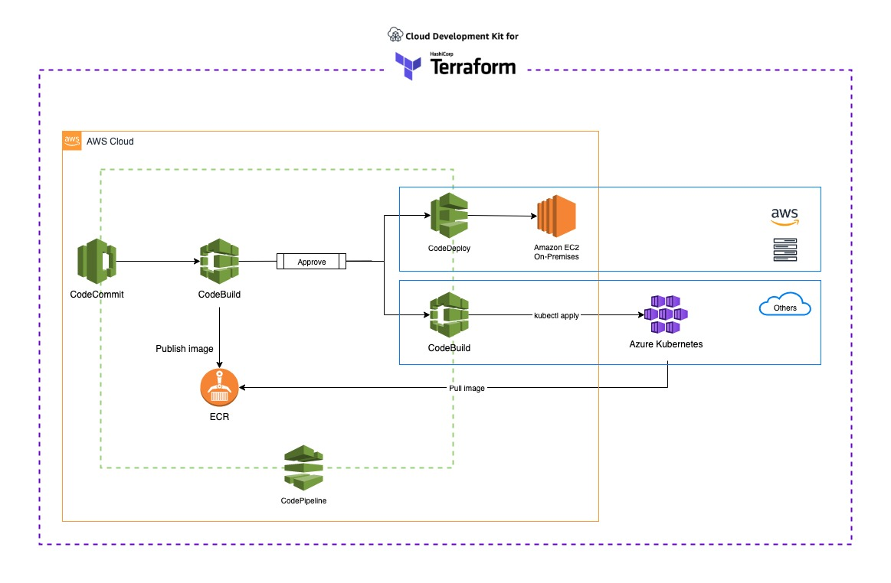

## Architecture diagram



## Deployment Steps
###  Step 1. Install Terraform and CDK on Terraform

- Install Terraform (MacOS)

```
$ brew tap hashicorp/tap
$ brew install hashicorp/tap/terraform
$ terraform version
```

- Install cdktf

```bash
$ npm install -g cdktf-cli
$ cdktf --version
```

###  Step 2. Login cloud provider credentials

```
$ export AWS_ACCOUNT_ID='your-aws-account-id'
$ export AWS_REGION='your-aws-region'
$ aws configure     # login for AWS
$ az login          # login for Azure
```

###  Step 3. Create an execution plan

```bash
$ cdktf get
$ cdktf plan
```

###  Step 4. Deploy the changes configuration

```bash
$ cdktf deploy
```

###  Step 5. Pull the Docker Image from AWS ECR in Azure Kubernetes

Update credential use `az aks get-credentials`

```
$ az aks get-credentials --resource-group aws-deployment-anywhere --name aws-deployment-anywhere
```

Upload kubeconfig to AWS S3 for AWS Codebuild, but better solution is [service principals](https://docs.microsoft.com/en-us/azure/aks/kubernetes-service-principal)

```
$ aws s3 cp ~/.kube/config s3://aws-deployment-anywhere-store-${AWS_REGION}-${AWS_ACCOUNT_ID}/kubeconfig
```

Setting pull image secret to Kubernetes

```
$ kubectl create secret docker-registry regcred \
    --docker-server=${AWS_ACCOUNT_ID}.dkr.ecr.${AWS_REGION}.amazonaws.com \
    --docker-username=AWS \
    --docker-password=$(aws ecr get-login-password) 
```

###  Step 6. Deploy source code

```
$ git clone https://git-codecommit.us-east-1.amazonaws.com/v1/repos/aws-deployment-anywhere
$ cd aws-deployment-anywhere
$ cp -R ../backend/* .
$ git add . && git commit -am "initial commit" && git push origin master
```

###  Step 7. View deploy successfully from AWS CodePipeline


###  Step 8.

```
$ kubectl get pod
NAME                       READY   STATUS    RESTARTS   AGE
backend-5d5d449bc8-5dkpq   1/1     Running   0          9m28s
backend-5d5d449bc8-xh8qp   1/1     Running   0          9m28s

$ kubectl get service
NAME         TYPE           CLUSTER-IP   EXTERNAL-IP     PORT(S)        AGE
backend      LoadBalancer   10.0.95.86   <backend-address>   80:30483/TCP   10m

$ curl <backend-service-address>
Running Backend Container: backend-xxxxx
```

